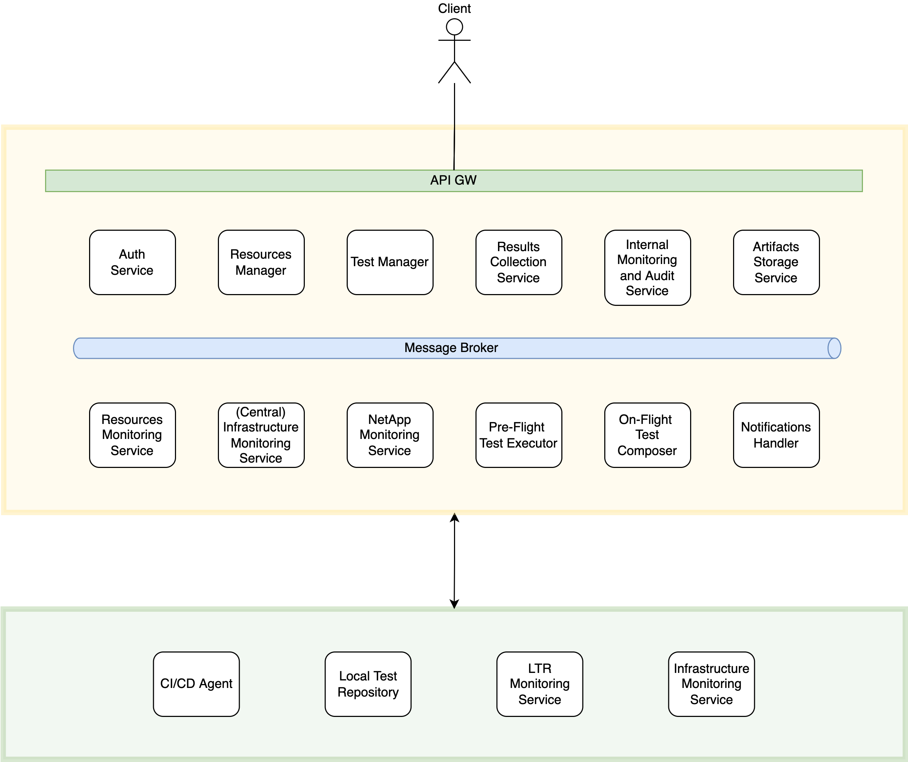

# VPilot

VPilot - Network Function Validation Pilot - is a fully automated service for testing and validating 5G Network Functions. To do so, it performs two types of tests: (i) pre-defined tests, that are already onboarded in this service, and mainly address the validation of infrastructure and security aspects, and (ii) developer-defined tests, which are onboarded by the Network Functions developers, and validate the internal business logic of each Network Function. After validating a Network Function, VPilot provides the Network Functions developers a detailed report of the outcomes of the testing process.

## High-level Architecture

